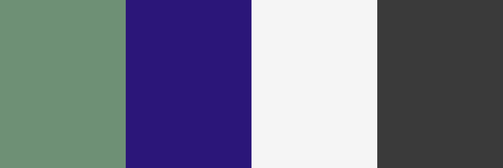
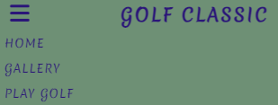

# Midland Golf Classic

# Goal for this Project

Welcome to the Midlands Golf Classic. This site gives information about the golf classic competetion, the location and the prizes to be won. It also gives the ability to make contact with the club easily through social media or directly via the registration form.

# Table of Contents

- [Midland Golf Classic](#midland-golf-classic)
- [Goal for this Project](#goal-for-this-project)
- [Table of Contents](#table-of-contents)
- [UX](#ux)
  - [User Goals](#user-goals)
  - [User Stories](#user-stories)
  - [Site owners Goals](#site-owners-goals)
    - [Requirements](#requirements)
    - [Expectations](#expectations)
    - [Fonts](#fonts)
    - [Icons](#icons)
    - [Colours](#colours)
    - [Structure](#structure)
- [Wireframes](#wireframes)
    - [Desktop Wireframe](#desktop-wireframe)
    - [Tablet Wireframe](#tablet-wireframe)
    - [Phone Wireframe](#phone-wireframe)
- [Features](#features)
  - [Existing Features](#existing-features)
    - [Navigation Bar](#navigation-bar)

# UX

## User Goals

* Visually appealing, including images.
* Easily navigated around.
* Quality and valuable content.
* Easily found contact details.
* Form to directly contact the club.
* Map to location of club.

## User Stories

* As a user, I want to be able to easily contact the club.
* As a user, I want to be able to make contact with the club via several different methods, i.e. social media.
* As a user, I want to be able to easily navigate through the website.
* As a user, I want to know where the club is based.
* As a user, I want to know what event is taking place.

## Site owners Goals

* Promote the golf classic competition.
* Increase the number of competitors.
* Increase rankings on search engines.

### Requirements

* Easy to navigate on various screen sizes.
* Clear information on the services provided.
* Keep the user interested with the prizes to be won in the competetion.
* Simple methods of contacting the club.
* Visually inviting so users do not leave.

### Expectations

* I expect to know if a form has been submitted properly and if items are not filled in, to be prompted.
* I expect all links to social media sites to be opened in a new tab.
* I expect all navigation links to work correctly.
* I expect screen size not to affect the quality of the website.

\
&nbsp;
[Back to Top](#table-of-contents)
\
&nbsp;

### Fonts
I have used [Google Fonts](https://fonts.google.com/ "Google Fonts") to find a text that best suits the feel of the website. For the main text I have chosen [Merienda](https://fonts.google.com/specimen/Merienda?preview.text=Golf%20Classic&query=merienda) as I feel it is has a sharp, simple and easy to read look.

### Icons

I will used some icons for my website from the [Font Awesome library](https://fontawesome.com/ "Font Awesome"). These icons will be used where there is no explination needed to their meaning, like the social media links and the hamburger icon for navigational links on smaller devices. Other icons will be use for style to the prize section.

### Colours

I have used [Coolers](https://coolors.co/ "Coolors") to help in the selection of my colour scheme.

- #6e9075ff - This colour will be used as the main background colour.
- #2b1679ff - This colour will be used as the text colour.
- #F5F5F5 - This colour will be used as a backgroung behind images in the Prize section.
- #3a3a3a - This colour will be used for box shadow.

### Structure

I will be building my website with a mobile first mindset using the Galaxy Fold (280px) as the smallest screen size for styling to look good on. The screen size breakpoints that I will be using are from [Bootstrap breakpoints](https://getbootstrap.com/docs/5.0/layout/breakpoints/ "Bootstrap").

| Screen Size | Breakpoint |
| ----------- | ---------- |
| x-small     | <576px     |
| small       | => 576px   |
| medium      | => 768px   |
| large       | => 992px   |
| x-large     | => 1200px  |

\
&nbsp;
[Back to Top](#table-of-contents)
\
&nbsp;

# Wireframes

I have used [Balsamic](https://balsamiq.com/wireframes/ "Balsamic") to develop my wireframes for my website. I initially had three pages for my website but changed to one, this gets the user through the content quickly by access to the registration form and details via scrolling or directly via the navigation bar.

The wireframes are below:

### [Desktop Wireframe](wireframes/Desktop%20Wireframe.png "Desktop wireframe")

### [Tablet Wireframe](wireframes/Tablet%20Wireframe.png "Tablet wireframe")

### [Phone Wireframe](wireframes/Phone%20Wireframe.png "Phone wireframe")

\
&nbsp;
[Back to Top](#table-of-contents)
\
&nbsp;

# Features

## Existing Features

### Navigation Bar

The navigation bar is fully responsive to allow for various screen sizes. It includes links to manover around the site easily and the competetion header doubles as a link back to the home screen.

+ Large Desktop screens (>=992px)
\
&nbsp;
        
    -   Spanning the full width of the device and with all navigational links (Home, Gallery, Play Golf (Registration page), this gives ease and clear use to the end user.

    -   In order for the user to visably see which of the links they are hovering over there is a bar below the text.

    
    \
    &nbsp;
    
    
+ iPad devices (<992px)
\
&nbsp;
        
    - Like the desktop this also spans the full width of the device and with all navigational links (Home, Gallery, Play Golf (Registration page)
    \
    &nbsp;

+ Phone devices (<768px)
\
&nbsp;
        
    -  To save screen space the navigational menu takes on the burger style.

    - When pressed, it opens up the main menu with all the links available.

      
      \
      &nbsp;

        

\
&nbsp;
[Back to Top](#table-of-contents)
\
&nbsp; 
